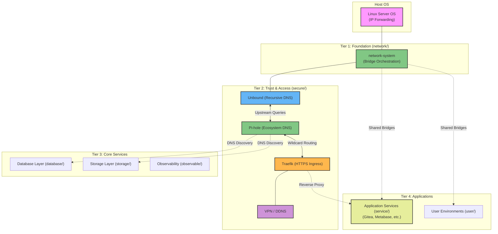

# Overview

The **container-system** is a comprehensive, modular container-native operating system architecture. It treats every infrastructure concern—from low-level networking and DNS resolution to application services and storage—as an isolated, versioned container. This approach ensures high portability, security, and consistent deployments across different environments.

By decoupling the system into autonomous modules (e.g., `network`, `secure`, `service`, `storage`), it serves as a robust foundation for a wide array of use cases. Whether deploying a self-hosted homelab, a secure development environment, or a scalable backend infrastructure, the `container-system` provides the necessary core ecosystem to run services reliably.

## System Architecture

The architecture is layered, building from foundational network and security infrastructure up to user-facing applications:

### Key Architectural Pillars

1.  **Network System (`network/`)**: The bedrock of the architecture. It provisions isolated bridge networks (e.g., `network_service`, `network_security`) and handles IP orchestration. All other modules attach to these predefined, static networks.
2.  **Trust & Security (`secure/`)**: The unified trust layer. It chains critical services:
    - **Unbound**: Connects directly to root DNS servers for secure, recursive resolution.
    - **Pi-hole**: Uses Unbound as its upstream, providing ecosystem-wide ad-blocking and resolving internal `.docker.local` wildcard domains.
    - **Traefik**: Uses Pi-hole's wildcard DNS to automatically discover and securely proxy (HTTPS) incoming traffic to application containers across the network.
3.  **Modular Services  (`service/` & others)**: Applications are deployed into designated tiers (development, display, etc.). They consume the infrastructure provided by the lower tiers—using the established bridges for communication, Pi-hole for service discovery, and Traefik for encrypted user access.
4.  **Data & State (`database/`, `storage/`)**: Centralized state management. Instead of individual apps running siloed databases, shared PostgreSQL/Redis instances and centralized backup structures are utilized to optimize resources and simplify data recovery.

---

## Deployment Strategy

Because the architecture relies on strict dependency chains, the system must be deployed in a specific order:

1.  **Initialize Network**: Start by deploying the `network` module to create the necessary bridge interfaces.
2.  **Establish Trust**: Deploy the `secure` module components sequentially (Unbound → Pi-hole → Traefik) to enable DNS and ingress routing.
3.  **Provision Core Infrastructure**: Bring up shared resources in `database/` and `storage/`.
4.  **Launch Workloads**: Finally, deploy the actual applications inside `service/` or development environments in `user/`.

