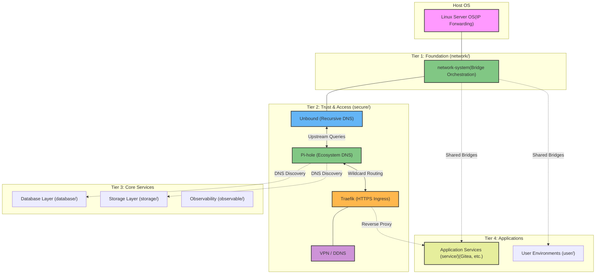

# Overview
Designed to run directly on the host's container runtime layer, `container-system` transforms standard Docker environments into a comprehensive operating ecosystem.
This approach provides a robust foundation for homelabs or production-grade backend infrastructure.

## System Architecture

The architecture is layered, building from foundational network and security infrastructure up to user-facing applications:

### Key Architectural Pillars

1.  **Network System (`network/`)**: The bedrock of the architecture. It provisions isolated bridge networks (e.g., `network_service`, `network_security`) and handles IP orchestration. All other modules attach to these predefined, static networks.
2.  **Trust & Security (`secure/`)**: The unified trust layer. It chains critical services:
    - **Unbound**: Connects directly to root DNS servers for secure, recursive resolution.
    - **Pi-hole**: Uses Unbound as its upstream, providing ecosystem-wide ad-blocking and resolving internal `.docker.local` wildcard domains.
    - **Traefik**: Uses Pi-hole's wildcard DNS to automatically discover and securely proxy (HTTPS) incoming traffic to application containers across the network.
3.  **Modular Services  (`service/` & others)**: Applications are deployed into designated tiers (development, display, etc.). They consume the infrastructure provided by the lower tiers—using the established bridges for communication, Pi-hole for service discovery, and Traefik for encrypted user access.
4.  **Data & State (`database/`, `storage/`)**: Centralized state management. Instead of individual apps running siloed databases, shared PostgreSQL/Redis instances and centralized backup structures are utilized to optimize resources and simplify data recovery.

---

## Module Components

The `container-system` repository is logically divided into specialized directories, each acting as a distinct module in the operating ecosystem:

| Module | Core Purpose | Example Services / Tools |
|---|---|---|
| [network](./network/) | Foundational bridge orchestration and IP assignment | `network-system` |
| [secure](./secure/)  | Ecosystem trust layer (DNS, ingress, VPN, DDNS) | Pi-hole, Unbound, Traefik, WireGuard |
| [service](./service/) | Core application, display, and utility containers| Gitea, Woodpecker |
| [database](./database/) | Centralized database cluster servers | PostgreSQL, Redis, SQLite |
| [storage](./storage/) | Centralized structured persistence | Minio, Registry |
| [observable](./observable/) | Monitoring, telemetry, and logging stacks | Grafana, Loki |
| [backup](./backup/) | Automated snapshot and data safety systems | Basic |
| [user](./user/) | End-user dev environments and personal workspaces | Maintenance |
| [app](./app/) | Packaged languages/framework bases | Conda |
| [os](./os/) | Base OS foundation images for containers | Ubuntu Base |
| [terraform](./terraform/) | Infrastructure as Code provisioning | Automation |

---

## Deployment Strategy

Because the architecture relies on strict dependency chains, the system must be deployed in a specific order:

1.  **Initialize Network**: Start by deploying the `network` module to create the necessary bridge interfaces.
2.  **Establish Trust**: Deploy the `secure` module components sequentially (Unbound → Pi-hole → Traefik) to enable DNS and ingress routing.
3.  **Provision Core Infrastructure**: Bring up shared resources in `database/` and `storage/`.
4.  **Launch Workloads**: Finally, deploy the actual applications inside `service/` or development environments in `user/`.

