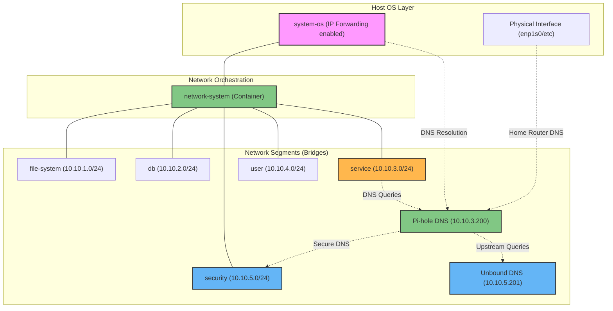

# Overview

This directory contains the core networking infrastructure of the container ecosystem. It manages a segmented bridge architecture designed for isolation, security, and static IP orchestration, acting as the foundation for all service-to-service, service-to-host, and external network communication (e.g., providing DNS resolution for the local home router via the host's physical interface).

## System Architecture

The following diagram illustrates how the Network System integrates with the Host OS to manage segmented service layers:



### Key Architectural Patterns

1.  **System-OS Relationship**: The network stack is indispensable from the host OS. A critical requirement is enabling IP forwarding (`net.ipv4.ip_forward=1`) to allow the host to route traffic between the segmented Docker bridges.
2.  **Segmentation by Function**: Services are isolated into tiers (Database, User, Security, etc.) to minimize the blast radius of any individual component.
3.  **Static IP Orchestration**: All networks use a consistent `10.10.x.x` addressing scheme. The `network-system` container ensures these networks are persistent and provides a central anchor for the gates.
4.  **DNS Integration**: Services within the ecosystem typically use the shared DNS resolver at `10.10.3.200` (Pi-hole) for service discovery.

---

## Getting Started

> [!WARNING]
> **DNS Prerequisite (`network_security`)**: Before deploying Pi-hole or other service layer components, you MUST deploy `Unbound` (`10.10.5.201`). It acts as the foundational secure resolver for the ecosystem. Pi-hole will fail to resolve external queries without it.

### 1. Host Preparation (Indispensable)
Ensure the host OS is configured to forward traffic between the network segments:
```bash
# Enable IP forwarding
echo "net.ipv4.ip_forward = 1" | sudo tee -a /etc/sysctl.conf
sudo sysctl -p
```

### 2. Deploy Network Infrastructure
To initialize the bridge interfaces and the orchestration container:
1. Navigate to this directory.
2. Run the deployment command:
```bash
docker compose up -d
```

### 3. Verify Bridge Interfaces
You can check the created bridges on the host system:
```bash
ip link show | grep br-<network_name>
```

### 4. Integration
Once active, other services can connect to these networks using their specific subnets (e.g., `10.10.3.x` for general services).
