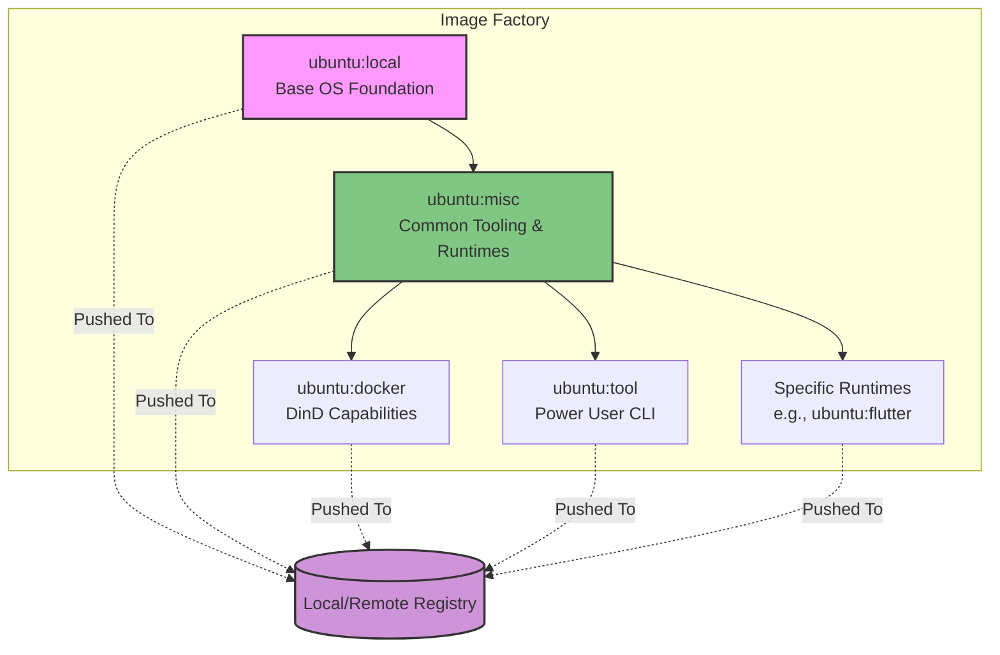

# Overview

The `os/ubuntu` module provides the foundational Operating System images for the broader ecosystem. Inspired by standardizing runtime environments (akin to DevContainers or Coder), it delivers highly reproducible, ready-to-code environments. By integrating directly with the system's local/remote container registry, these base images serve as the atomic building blocks not only for isolated development workspaces but also for future deployments of your own custom-built applications.

## System Architecture

The image compilation architecture follows a layered, multi-stage build strategy using Docker Compose, creating a hierarchy of increasingly specialized environments:

*   **Base Layer (`ubuntu:local`)**: The absolute minimal Ubuntu OS foundation equipped with essential connectivity and package management baselines.
*   **Misc Layer (`ubuntu:misc`)**: Builds upon the base layer by injecting common development utilities, language runtimes, and standard dependencies.
*   **Specialized Layers**:
    *   `ubuntu:docker`: Incorporates Docker-in-Docker (DinD) capabilities, enabling nested containerization and local CI/CD testing.
    *   `ubuntu:tool`: Extends the misc layer with power-user tools and advanced CLI utilities.
    *   *Language/Framework Variants* (e.g., `flutter`): Bespoke environments tailored for specific ecosystems.

These images are ultimately pushed to the integrated `storage/` registry, making them universally accessible to the `terraform/ubuntu` provisioner and the broader application deployment pipeline.

## Key Architectural Pillars

1.  **Workspace as Code**: Developers receive instant, consistent environments with all necessary tooling pre-installed, effectively eliminating the "it works on my machine" syndrome and standardizing onboarding.
2.  **Registry-Driven Ecosystem**: Built images are pushed to a centralized registry within the infrastructure. This ensures that instances spawned across different nodes or deployment phases use the exact same immutable, version-controlled artifact.
3.  **Layered Extensibility**: The multi-stage build approach (Base → Misc → Specialized) optimizes storage overhead and build times by maximizing Docker layer caching. Updates to the base layer seamlessly propagate down the chain.
4.  **Universal Deployment Parity**: The same foundational images used for local development are designed to be the identical base for packaging and deploying "own apps" into production within the `service/` tier, ensuring absolute environment parity from code to production.

## Future-Proofing & Own Apps Deployment (The Vision)

Looking forward, `os/ubuntu` transcends being just a development environment generator. It represents the genesis of all compute in the ecosystem. As you begin to develop your own proprietary applications, they won't need to rebuild complex base images from scratch. Instead, your CI pipelines will `FROM ubuntu:misc` (or a specific variant) pulled locally from your registry. This creates an incredibly efficient, secure, and unified deployment track where everything running in your homelab or production server shares the exact same curated genetic makeup.
