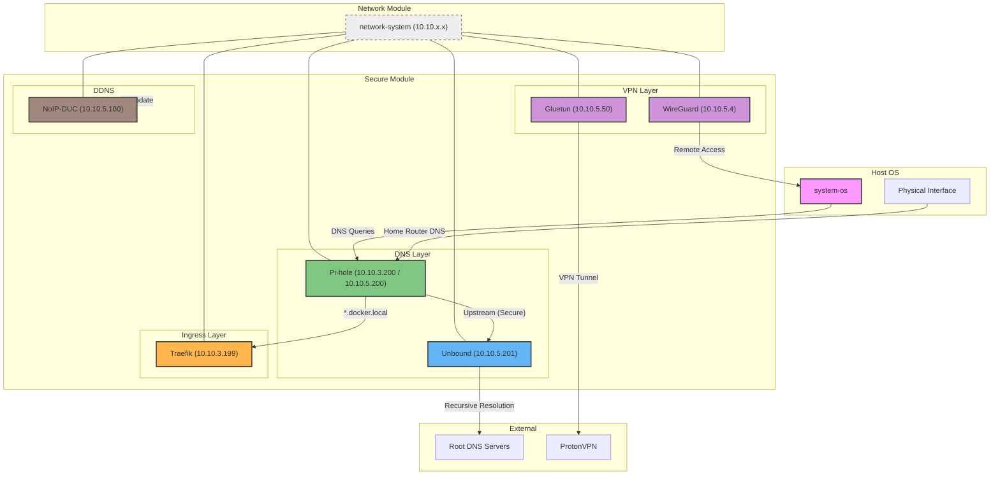

# Overview

The **Secure** module is a core pillar of the container-native operating system architecture where every infrastructure concern—DNS, routing, VPN, privacy—is managed as an isolated, versioned container. This module owns all security-critical services: name resolution, HTTPS ingress, VPN tunneling, and dynamic DNS. It is the trust layer that every other module in the system depends on.

## System Architecture

The following diagram shows how the Secure module's components interact with each other, the Network System, and the Host OS:



## Module Components

| Service | IP | Network(s) | Role |
|---|---|---|---|
| [Unbound](./unbound/) | `10.10.5.201` | `security` | Recursive DNS resolver, DNSSEC validation against root servers |
| [Pi-hole](./pihole/) | `10.10.3.200` / `5.200` / `4.200` | `service`, `security`, `user` | Ad-blocking DNS, wildcard local domains, ecosystem-wide name resolution |
| [Traefik](./traefik/) | `10.10.3.199` | `service` | HTTPS reverse proxy, TLS termination, Docker-based service discovery |
| [WireGuard](./wireguard/) | `10.10.5.4` | `security`, `service` | Self-hosted VPN server for remote access to the internal network |
| [Gluetun](./gluetun/) | `10.10.5.50` | `security`, `service` | VPN client tunnel (ProtonVPN) for outbound traffic anonymization |
| [NoIP-DUC](./noip-duc/) | `10.10.5.100` | `security` | Dynamic DNS updater, keeps external hostname pointing to home IP |

### How the Module Fits into the Container-System

The `container-system` is organized into functional modules (`network`, `secure`, `service`, `file-system`, etc.), each owning a specific domain. The **Secure** module is unique because it is a **cross-cutting dependency**: almost every other module relies on it for DNS, routing, or encrypted access.

```
container-system/
├── network/       Bridge orchestration (must deploy first)
├── secure/        DNS, ingress, VPN, DDNS
├── service/       Application services (depend on secure)
└── ...
```

**Dependency chain**:
1. **`network/`** → Creates the bridge segments (`10.10.x.0/24`).
2. **`secure/unbound`** → Provides foundational DNS resolution.
3. **`secure/pihole`** → Builds on Unbound; provides ecosystem-wide DNS + ad blocking.
4. **`secure/traefik`** → Builds on Pi-hole; routes `*.docker.local` to services via HTTPS.
5. **`secure/wireguard`** & **`secure/gluetun`** → Use Pi-hole as internal DNS, operate on the security segment.
6. **`secure/noip-duc`** → Keeps the external hostname updated for WireGuard remote access.

---

## Getting Started

> [!WARNING]
> Services in this module must be deployed **in order** due to cascading dependencies. Follow the sequence below.

### Deployment Order

| Step | Service | Docs |
|------|---------|------|
| 1 | Network System (bridges) | [network/](../network/) |
| 2 | Unbound | [secure/unbound/](./unbound/) |
| 3 | Pi-hole | [secure/pihole/](./pihole/) |
| 4 | Traefik | [secure/traefik/](./traefik/) |
| 5 | WireGuard | [secure/wireguard/](./wireguard/) |
| 6 | Gluetun | [secure/gluetun/](./gluetun/) |
| 7 | NoIP-DUC | [secure/noip-duc/](./noip-duc/) |
