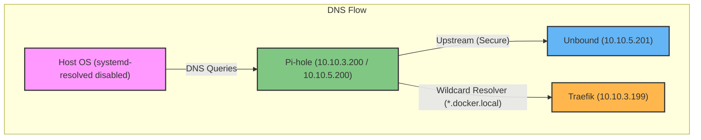

# Overview

This directory contains the Pi-hole DNS service, which serves as the central name resolution system for the container ecosystem. It is designed to work in tandem with Unbound for recursive DNS and Traefik for service discovery, integrating tightly with the host OS to provide seamless connectivity across all environments.

## System Architecture

The following diagram illustrates how Pi-hole interacts with the host OS and the secure networking layer:



### Key Architectural Patterns

1.  **OS Integration**: To ensure the host uses the containerized DNS, `systemd-resolved` must be disabled, allowing Pi-hole to take over port 53 on the host interface.
2.  **Multihomed Networking**: Pi-hole is connected to multiple networks to bridge different zones:
    - `network_service` (`10.10.3.200`): For general service discovery.
    - `network_security` (`10.10.5.200`): For communication with the secure Unbound upstream.
    - `network_user` (`10.10.4.200`): For client-side access.
3.  **Secure Upstream**: Pi-hole uses Unbound (`10.10.5.201`) as its primary DNS upstream, ensuring all external queries are handled privately and securely.
4.  **Wildcard Routing**: A custom dnsmasq configuration routes all `*.docker.local` traffic to Traefik (`10.10.3.199`), enabling dynamic internal routing.

---

## Getting Started

### 1. Host Preparation
Disable the local DNS resolver to free up port 53:
```bash
sudo systemctl disable systemd-resolved.service
sudo systemctl stop systemd-resolved
```

### 2. Docker Daemon Configuration
Update `/etc/docker/daemon.json` to make containers use Pi-hole by default:
```json
{
  "dns": ["10.10.3.200"]
}
```
Then restart Docker:
```bash
sudo systemctl restart docker
```

### 3. Deploy Service
```bash
docker compose up -d
```

### 4. Wildcard DNS Setup
To route local domains to Traefik, ensure the following configuration exists:
```bash
# In /etc/dnsmasq.d/05-docker-wildcard.conf
address=/.docker.local/10.10.3.199
```
And reload the DNS:
```bash
pihole reloaddns
```