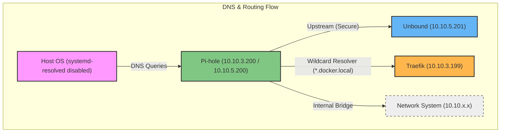

# Overview

This directory contains the Pi-hole DNS service, the central name resolution system for the container ecosystem. It is designed to work in tandem with Unbound for recursive DNS and Traefik for service discovery, integrating tightly with the host OS and the shared network infrastructure.

## System Architecture

The following diagram illustrates how Pi-hole interacts with the host OS, the secure networking layer, and the shared infrastructure:



### Key Architectural Patterns

1.  **OS Integration**: To ensure the host uses the containerized DNS, `systemd-resolved` must be disabled, allowing Pi-hole to take over port 53 on the host interface.
2.  **Multihomed Networking**: Pi-hole connects to the core segments of the shared `network` infrastructure:
    - **`network_service`** (`br-svc` | `10.10.3.0/24`): Primary interface for container DNS and service discovery. Pi-hole IP: `10.10.3.200`.
    - **`network_security`** (`br-sec` | `10.10.5.0/24`): Isolated segment for secure communication with Unbound (`10.10.5.201`). Pi-hole IP: `10.10.5.200`.
    - **`network_user`** (`br-user` | `10.10.4.0/24`): Access segment for user-facing services and clients. Pi-hole IP: `10.10.4.200`.
3.  **Secure DNS Uplink**: All external resolution is proxied through Unbound, providing a DNSSEC-capable recursive resolver within the `security` network segment.
4.  **Static IP Orchestration**: All IPs are statically assigned within the `10.10.x.x` range managed by the central [network system](file:///home/luist/docs/container-system/network/README.md).

---

## Getting Started

### 1. Host Preparation
Disable the local DNS resolver to free up port 53:
```bash
sudo systemctl disable systemd-resolved.service
sudo systemctl stop systemd-resolved
```

### 2. Docker Daemon Configuration
Update `/etc/docker/daemon.json` to make containers use Pi-hole by default (using the `service` network IP):
```json
{
  "dns": ["10.10.3.200"]
}
```
Then restart Docker:
```bash
sudo systemctl restart docker
```

### 3. Deploy Service
Ensure the shared [networks](file:///home/luist/docs/container-system/network) are running before starting Pi-hole:
```bash
docker compose up -d
```

### 4. Wildcard DNS Setup
To route local domains to Traefik, ensure the following configuration exists:
```bash
# In /etc/dnsmasq.d/05-docker-wildcard.conf
address=/.docker.local/10.10.3.199
```
And reload the DNS:
```bash
pihole reloaddns
```