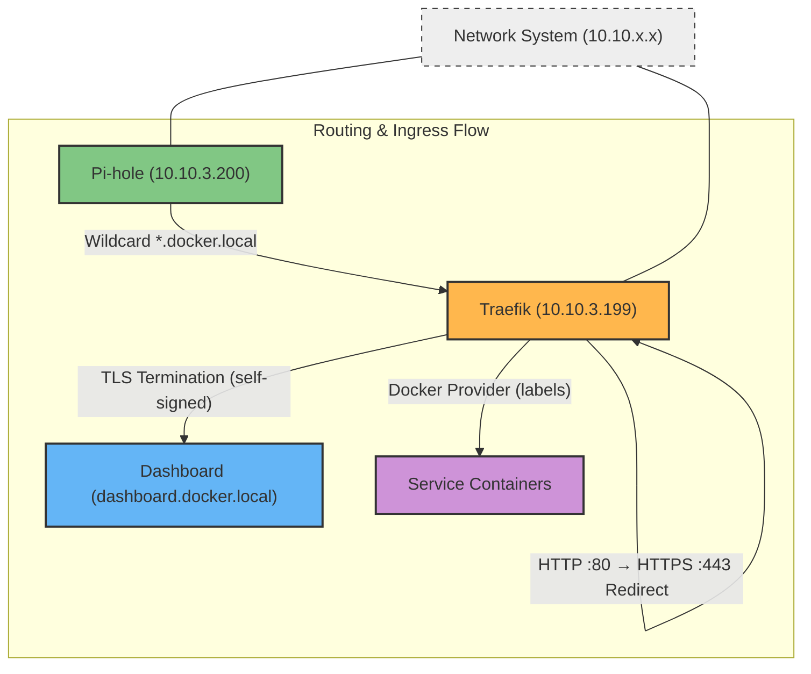

# Overview

This directory contains the Traefik reverse proxy service, the central HTTPS ingress gateway for the container ecosystem. It automatically discovers services via Docker labels, terminates TLS with self-signed certificates for the `*.docker.local` domain, and enforces HTTP-to-HTTPS redirection. It integrates tightly with the shared network infrastructure and relies on Pi-hole for wildcard DNS resolution.

> [!IMPORTANT]
> **Traefik depends on Pi-hole and the Network System.** Pi-hole must be configured with a wildcard DNS entry (`*.docker.local → 10.10.3.199`) to route local domains to Traefik. The `network_service` bridge must exist before deploying.

## System Architecture

The following diagram illustrates how Traefik interacts with Pi-hole, the network infrastructure, and downstream services:



### Key Architectural Patterns

1.  **Docker Provider**: Traefik auto-discovers services via the Docker socket. Only containers with `traefik.enable=true` labels are exposed. All routing uses the `network_service` bridge by default.
2.  **TLS by Default**: Every connection is upgraded from HTTP to HTTPS via a permanent redirect. Self-signed certificates (`certs/local.crt` & `certs/local.key`) are loaded through a dynamic TLS configuration (`dynamic/tls.yaml`).
3.  **Static IP Orchestration**: Traefik is anchored at `10.10.3.199` on the `network_service` bridge, the same network where Pi-hole resolves `*.docker.local` to this IP.
4.  **Security Hardening**: The container runs with `no-new-privileges:true` and mounts the Docker socket as read-only (`:ro`).
5.  **Dashboard**: The built-in Traefik dashboard is accessible at `dashboard.docker.local` over HTTPS.

---

## Getting Started

### 1. Prerequisites
Ensure the following services are running before deploying Traefik:
- **Network System**: The `network_service` bridge (`10.10.3.0/24`) must be initialized.
- **Pi-hole**: Must be configured with the wildcard DNS entry:
  ```bash
  # In /etc/dnsmasq.d/05-docker-wildcard.conf (inside Pi-hole)
  address=/.docker.local/10.10.3.199
  ```

### 2. Generate Self-Signed Certificates
If you don't already have certificates in the `certs/` directory, generate them:
```bash
openssl req -x509 -nodes -days 365 \
  -newkey rsa:2048 \
  -keyout certs/local.key \
  -out certs/local.crt \
  -subj "/CN=*.docker.local"
```

### 3. Deploy Service
Pull the image and start the container:
```bash
docker pull traefik:v3.4
docker compose up -d
```

### 4. Verify Dashboard
Access the Traefik dashboard at:
```
https://dashboard.docker.local
```

### 5. Expose a Service (Example)
To route a container through Traefik, add these labels to its `docker-compose.yml`:
```yaml
labels:
  - "traefik.enable=true"
  - "traefik.http.routers.myapp.rule=Host(`myapp.docker.local`)"
  - "traefik.http.routers.myapp.entrypoints=web"
  - "traefik.http.services.myapp.loadbalancer.server.port=<port>"
```
The container must be on the `network_service` network for Traefik to discover it.