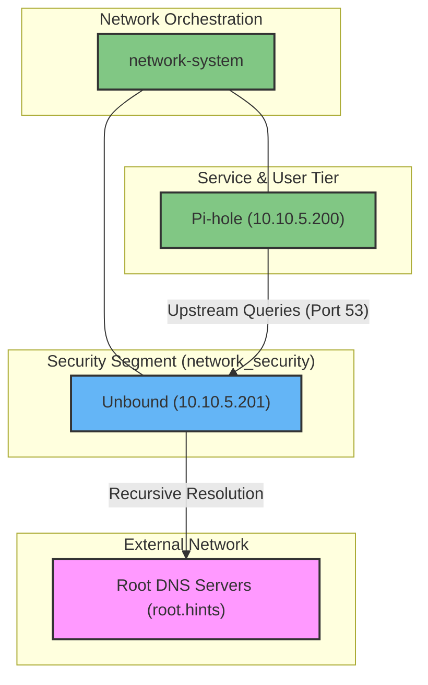

# Overview

This directory contains the Unbound Recursive DNS service, a critical foundational component of the container ecosystem's security layer. It acts as the secure upstream resolver for Pi-hole, handling actual DNS resolution directly against the root name servers to ensure privacy and DNSSEC validation.

> [!IMPORTANT]
> **Unbound must be deployed and running BEFORE starting Pi-hole.** Pi-hole relies entirely on Unbound for external DNS resolution.

## System Architecture

The following diagram illustrates Unbound's role within the `network_security` segment and its relationship with Pi-hole and the external internet:



### Key Architectural Patterns

1.  **Strict Isolation**: Unbound operates exclusively on the `network_security` bridge (`10.10.5.0/24`). It exposes zero ports to the host machine, receiving queries only from authorized containers like Pi-hole.
2.  **Static IP Assignment**: Unbound is anchored at `10.10.5.201` to provide a reliable upstream target for Pi-hole configuration.
3.  **Recursive Independence**: By bypassing standard ISP or public DNS providers (like Google or Cloudflare) and querying root servers directly, the ecosystem maintains absolute control over DNS privacy.

---

## Getting Started

### 1. Pull the Image

Ensure the shared `networks` from the `network-system` are initialized before proceeding:

```bash
docker pull mvance/unbound:1.21.1
```

### 2. Deploy Service

Start the Unbound container in detached mode, 
one-time setup preview compose-dns: `1.1.1.1`:

```bash
docker compose up -d
```

### 3. Download Initial `root.hints`

After deploying the container for the first time, it's highly recommended to download the latest DNS root hints file to allow Unbound to securely bootstrap its connection to the root servers. You can run this directly inside the running container:

```bash
docker exec -it dns_unbound sh -c "apt update && apt install curl -y"
docker exec -it dns_unbound sh -c "curl -o /opt/unbound/etc/unbound/root.hints https://www.internic.net/domain/named.cache"
```

Then, restart the service to apply the new hints file, delete `-dns` from the compose file.

```bash
docker compose restart
```

### 4. Next Steps
Once Unbound is running correctly on `10.10.5.201`, you may proceed to deploy 