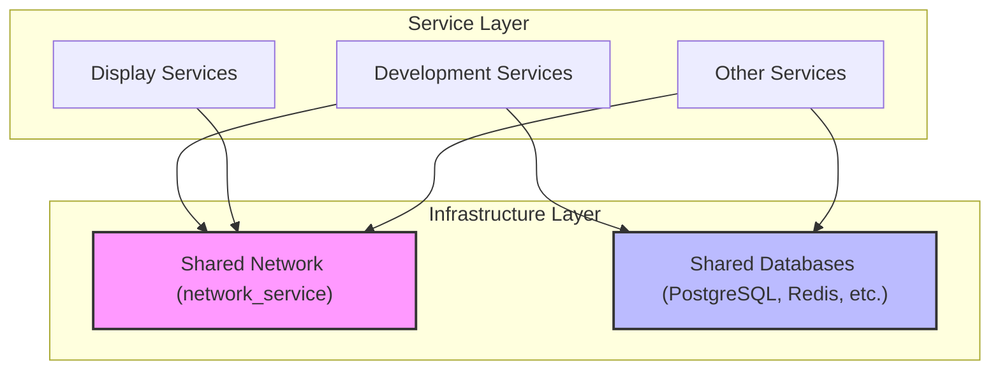

# Container System - Services Overview

This directory contains the core services of the container ecosystem, organized by their primary function. The system is designed to be modular, leveraging shared infrastructure for networking and persistence.

## System Architecture

The following diagram illustrates how services interact with the shared infrastructure:

### Key Architectural Patterns

1.  **Networking**: Most services are connected to an external `network_service`. This allows for cross-container communication using static IP addresses (assigned in the `10.10.3.x` range).
2.  **Shared Databases**: Instead of each service running its own database instance, common databases (like PostgreSQL and Redis) are hosted centrally in the `/database` directory and shared across multiple services.
3.  **Persistence**: Data persistence is handled through Docker volumes, often mapped to external volumes or local paths for reliability.
4.  **DNS**: Services typically use a shared DNS resolver (e.g., `10.10.3.200`) to ensure consistent service discovery within the network.

---

## Service Categorization

The services are grouped into three main categories:

### Development
Essential tools for software development, coding, and environment management.
- **[Coder](./development/coder)**: Cloud-based development environments.
- **[Gitea](./development/gitea)**: Git with a cup of tea (self-hosted Git service).
- **[Notebook](./development/notebook)**: Interactive Jupyter notebooks.
- **[pgAdmin4](./development/pgadmin4)**: PostgreSQL administration tool.
- **[RStudio](./development/rstudio)**: IDE for R.
- **[SonarQube](./development/sonarqube)**: Continuous Inspection of Code Quality.
- **[Woodpecker](./development/woodpecker)**: A simple CI engine with great extensibility.

### Display
Services focused on UI/UX, remote display, and browser-based tools.
- **[Chrome](./display/chrome)**: Headless or containerized browser.
- **[Penpot](./display/penpot)**: Open-source design and prototyping platform.
- **[RustDesk](./display/rustdesk)**: Open-source remote desktop software.

### Other
A collection of various utility and data-focused services.
- **[Metabase](./other/metabase)**: Business intelligence and dashboarding.
- **[Nutch](./other/nutch)**: Highly extensible and scalable open source web crawler.
- **[Pocketbase](./other/pocketbase)**: Open source backend in 1 file.
- **[qBittorrent](./other/qbittorrent)**: BitTorrent client.
- **[Teable](./other/teable)**: A Postgres-based no-code database.
- **[YouTrack](./other/youtrack)**: Project management and issue tracking.

---

## Getting Started

To deploy a service:
1. Navigate to the specific service directory.
2. Ensure the `network_service` is active (check `/network`).
3. Run `docker compose up -d`.