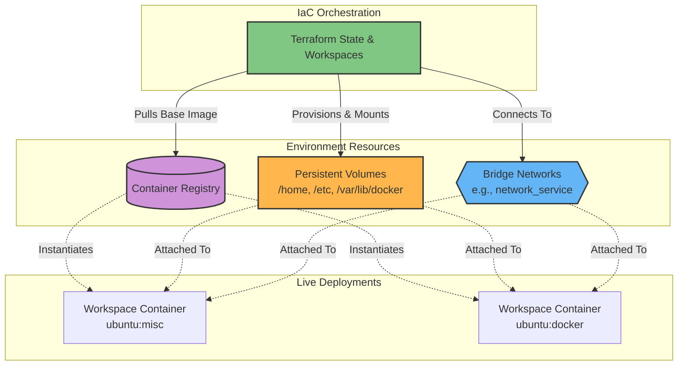

# Overview

The `terraform/ubuntu` module serves as the Infrastructure as Code (IaC) engine responsible for provisioning and orchestrating the tailored development environments defined in the `os/ubuntu` module. Moving beyond simple Docker Compose orchestration, this module leverages Terraform to dynamically manage container lifecycles, complex network attachments, and persistent state mapping, ensuring highly reproducible, scalable, and secure workspace deployments.

## System Architecture

The deployment architecture uses Terraform in conjunction with the Docker provider to bridge the gap between static image definitions and live runtime instances:

*   **Image Sourcing & Context**: Terraform pulls the pre-built `ubuntu:*` layered images (e.g., `misc`, `tool`, `docker`) directly from the local/remote integrated registry.
*   **Dynamic Resource Orchestration**: User configuration files (`terraform.tfvars`) dictate the instantiation of customized containers, dynamically mapping attributes like usernames, credentials, and exposed ports.
*   **Persistence & Networking**:
    *   Containers are automatically attached to foundational system bridges (e.g., `network_service`).
    *   Persistent volumes (e.g., `/home`, `/etc`, and `/var/lib/docker` for DinD) are provisioned and mounted. This architecture guarantees that critical internal state—such as user identities, SSH keys, and workspace data—survives container rebuilds and host reboots.

## Key Architectural Pillars

1.  **Infrastructure as Code (IaC) supremacy**: Replaces manual container execution or basic orchestration with a declarative approach. The Terraform state acts as the single source of truth for all running development environments.
2.  **Dynamic Configuration & DRY Principles**: Utilizes dynamic blocks and variable iteration (e.g., looping through user lists). This allows DevOps to provision multiple tailored workspaces concurrently from a single concise, non-repetitive codebase.
3.  **Resilient State Management**: Strategic volume mounting, particularly for the `/etc` directory, is crucial. It ensures that post-build system configurations (like users created via scripts, or modified `sudoers`) remain strictly persistent across image updates and container recreation.
4.  **Seamless Integration with Trust Layer**: By deploying directly onto predefined internal networks, these development workspaces instantly participate in the ecosystem's DNS discovery (Pi-hole) and external HTTPS ingress routing (Traefik).

## Modular Workspaces & CI/CD Integration

The immediate power of this module is local workspace orchestration, but its true potential lies in automation. The terraform state acts as a programmable API for your environments. As the underlying infrastructure evolves, this IaC layer can be seamlessly integrated into CI/CD pipelines (like Woodpecker or Gitea Actions) to spin up ephemeral, isolated testing environments on demand. Furthermore, the exact same Terraform logic could be templated to orchestrate your "own apps," creating a unified deployment standard from development workspace to production service.